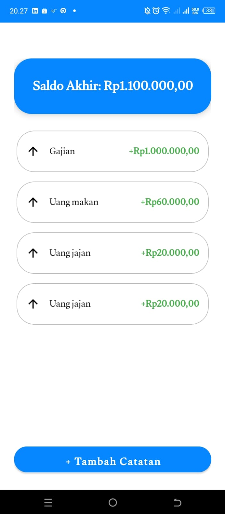
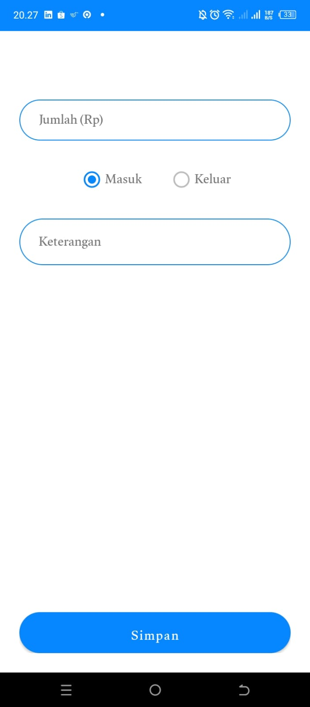

### 💰 Catatan Keuangan - Android App

Catatan Keuangan adalah aplikasi Android sederhana namun elegan untuk manajemen arus kas pribadi. Aplikasi ini dirancang untuk membantu pengguna mencatat pemasukan dan pengeluaran harian dengan antarmuka yang bersih (Clean UI) dan pengalaman pengguna (User Experience) yang mulus.

Projek ini dibuat untuk memenuhi Tugas Mata Kuliah Pemrograman Mobile.

### 📱 Fitur Unggulan

### 1. 📊 Manajemen Data (CRUD)

Pencatatan Transaksi: Input pemasukan dan pengeluaran dengan validasi data.

Penyimpanan Lokal: Menggunakan SQLite Database, data tersimpan permanen di perangkat tanpa perlu koneksi internet terus-menerus.

Riwayat Transaksi: Menampilkan list riwayat transaksi menggunakan RecyclerView yang efisien.

### 2. 🔔 Notifikasi Pintar (Cloud Integration)

Terintegrasi dengan Firebase Cloud Messaging (FCM).

Aplikasi dapat menerima Push Notification (pengingat/info) dari server secara real-time maupun saat aplikasi di background.

### 3. ✨ UI/UX Premium & Animasi

Custom Transitions: Implementasi animasi transisi antar activity (Slide In Right / Slide Out Right) menggunakan interpolator fast_out_slow_in untuk pengalaman navigasi yang smooth seperti aplikasi native modern.

Splash Screen: Layar pembuka dengan branding logo aplikasi yang menggunakan Handler untuk memberikan jeda waktu (delay) yang halus sebelum transisi otomatis ke halaman utama, menciptakan kesan pertama (First Impression) yang profesional.

Responsive Layout: Penyesuaian layout (paddingTop) agar elemen UI input tidak tertutup oleh notch atau kamera depan pada smartphone modern.

### 4. 🇮🇩 Lokalisasi (Localization)

Format Rupiah & Lokasi: Sistem secara otomatis mendeteksi dan memformat mata uang ke standar Indonesia (Rp) menggunakan logika Locale("in", "ID") dan NumberFormat. Hal ini memastikan penulisan angka (titik/koma) sesuai ejaan yang benar.

Bahasa Antarmuka: Seluruh label, tombol, dan pesan dalam aplikasi menggunakan Bahasa Indonesia yang baku dan mudah dipahami pengguna lokal.

### 📷 Screenshots

#### Dashboard Saldo:

#### Input Transaksi:

#### Notifikasi Firebase:

#### splash screen lokasi:

link youtube:
***https://youtube.com/shorts/_FIVgLclFKY?feature=share*** 

### 🛠️ Teknologi yang Digunakan

Bahasa Pemrograman: Java

IDE: Android Studio (Ladybug/Koala)

Database: SQLite Open Helper

Cloud Service: Google Firebase (FCM)

Komponen UI: RecyclerView, CardView, RadioGroup

Desain Pattern: MVC (Model-View-Controller)

🚀 Cara Menjalankan Project

Clone Repositori

git clone [https://github.com/ridhofebriann/catatankeuangan-projek.git](https://github.com/ridhofebriann/catatankeuangan-projek.git)

Buka di Android Studio

Buka Android Studio -> File -> Open -> Cari folder hasil clone tadi.

Konfigurasi Firebase

Pastikan file google-services.json sudah ada di dalam folder app/.

(Catatan: Jika file ini tidak ada di repo karena alasan keamanan, silakan hubungi pengembang untuk mendapatkannya).

Run Application

Tunggu proses Gradle Build selesai.

Hubungkan HP Android atau gunakan Emulator.

Tekan tombol Run.

👤 Author

Ridho Febrian

Mahasiswa Teknik Informatika/Sistem Informasi

Universitas [Nama Kampus Kamu]

Dibuat dengan ❤️ menggunakan Android Studio.
