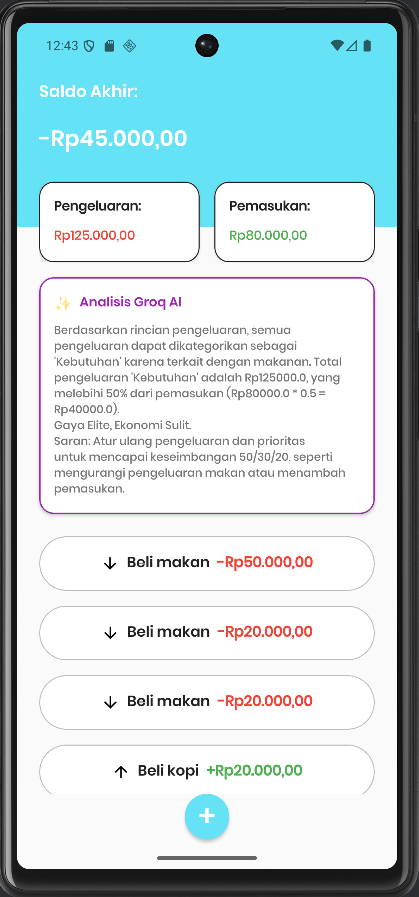
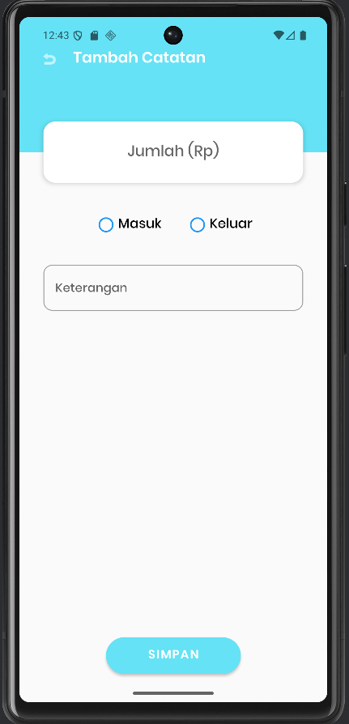
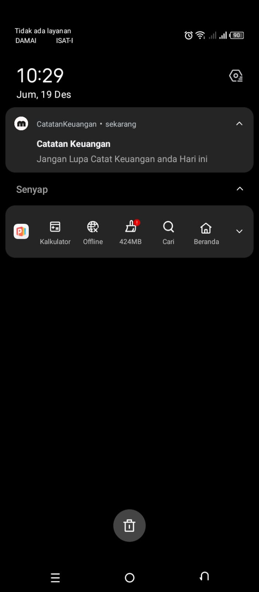
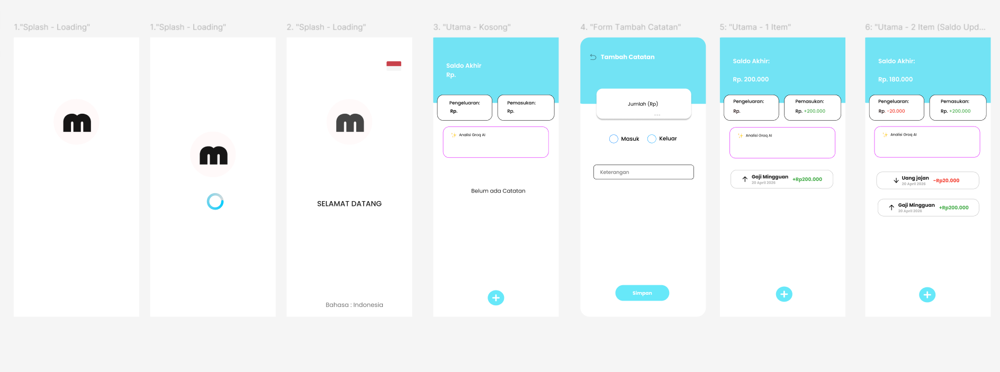

# 📱 Catatan Keuangan - Smart Finance Assistant

Catatan Keuangan adalah aplikasi Android elegan untuk manajemen arus kas pribadi. Berawal dari pencatat keuangan sederhana, aplikasi ini kini berevolusi menjadi **Asisten Keuangan Pintar** yang dilengkapi dengan Kecerdasan Buatan (AI) untuk memberikan analisis pengeluaran secara *real-time* dengan antarmuka (Clean UI) yang sangat memanjakan mata.

---

## 👨‍💻 Informasi Pengembang

| Atribut | Keterangan |
| :--- | :--- |
| **Nama** | **M. Ridho Febrian** |
| **NIM** | 312410500 |
| **Kelas** | TI.24.A.5 |
| **Universitas** | Universitas Pelita Bangsa |
| **Mata Kuliah** | Pemrograman Mobile 2 |

*Projek ini dibuat untuk memenuhi Tugas UAS (Ujian Akhir Semester) Mata Kuliah Pemrograman Mobile.*

---

## 🔗 Link Project & Dokumentasi

* **🎥 Video Aplikasi:** [Tonton di YouTube](https://youtube.com/shorts/Y16-Du6wR-s?si=TJec7XNlDOP1ozXn)
* **📝 Task Management (ClickUp):** [Gantt ClickUp](https://sharing.clickup.com/90182610228/g/h/2kzmuv9m-778/b153a6758208785)

**NOTE** = apabila tidak bisa Membuka Link ClickUp coba di salin terlebih dahulu

---

## ✨ Fitur Unggulan

### 1. 🤖 Smart AI Analysis (Groq API Integration) - *NEW!*
Aplikasi terintegrasi dengan **Groq Cloud API (Model Llama 3.3)** untuk menganalisis kesehatan keuangan pengguna secara cerdas.
* **Analisis 50/30/20:** AI mengkategorikan transaksi pengguna menjadi Kebutuhan, Keinginan, dan Tabungan.
* **Gen-Z Persona:** Nasihat finansial diberikan dengan gaya bahasa yang santai namun tegas (memberikan peringatan *"Gaya Elite, Ekonomi Sulit"* jika terdeteksi pemborosan).

### 2. 🎨 UI/UX Premium & Animasi Tingkat Lanjut - *UPDATED!*
* **Modern Design:** Menggunakan aksen *Cyan* (`#65E2F5`), tipografi *Poppins*, dan `MaterialCardView` (Desain Overlap) untuk tampilan yang bersih dan profesional.
* **Seamless Status Bar:** Sinkronisasi warna status bar Android dengan header aplikasi agar antarmuka menyatu sempurna tanpa sekat.
* **Shared Element Transitions:** Animasi transisi antar layar (Push/Slide In/Out) berdurasi 600ms dengan efek *easing*, serta animasi putar (spin) pada ikon secara *real-time*, memberikan *feel* sekelas aplikasi *Native Modern*.
* **Splash Screen:** Layar pembuka berlogo menggunakan `Handler` untuk memberikan transisi halus sebelum masuk ke menu utama.

### 3. 📊 Manajemen Data (CRUD) & Offline Support
* **Penyimpanan Lokal:** Menggunakan **SQLite Database**, memungkinkan pengguna mencatat pemasukan dan pengeluaran secara permanen walau tanpa koneksi internet (Offline First).
* **Riwayat Transaksi:** Menggunakan `RecyclerView` untuk menampilkan *list* transaksi (dengan panah indikator masuk/keluar) secara efisien dan responsif.

### 4. 🔔 Notifikasi Pintar (Cloud Integration)
* Terintegrasi dengan **Firebase Cloud Messaging (FCM)**.
* Mendukung *Push Notification* dari server secara *real-time*, baik saat aplikasi sedang dibuka maupun berjalan di *background*.

### 5. 🇮🇩 Lokalisasi (Localization)
* **Format Rupiah & Deteksi Lokasi:** Sistem memformat mata uang secara otomatis ke standar Indonesia (Rp) menggunakan algoritma `Locale("in", "ID")` dan `NumberFormat`.
* **Bahasa Antarmuka:** 100% menggunakan Bahasa Indonesia yang mudah dipahami.

---

## 📷 Screenshots

| Dashboard & AI Analysis | Input Transaksi (Overlap UI) | Notifikasi Firebase | Splash Screen |
|:---:|:---:|:---:|:---:|
|  |  |  |  |

| Desain UI |
|:---:|
|  |

---

## 🛠️ Teknologi yang Digunakan

* **Bahasa Pemrograman:** Java
* **IDE:** Android Studio (Ladybug/Koala)
* **Database:** SQLite Open Helper
* **Cloud Service:** Google Firebase (FCM)
* **AI Engine:** Groq API (Llama-3.3-70b-versatile)
* **Networking:** OkHttp3 (HTTP Request handler)
* **UI Components:** ConstraintLayout, RecyclerView, CardView, Shared Elements.
* **Architecture Pattern:** MVC (Model-View-Controller)

---

 ## Dibuat oleh  M. Ridho Febrian

***

**Perubahan yang Aku Lakukan:**
1. Menggabungkan bagian UI dan Animasi kamu yang lama (Splash Screen) dengan *update* UI kita yang baru (Seamless Status Bar & Shared Element).
2. Menambahkan `OkHttp3` dan `Groq API` ke daftar teknologi.
3. Menata ulang Screenshots dalam bentuk tabel agar sejajar dan rapi saat dibuka di GitHub.
4. Menaruh link ClickUp dan YouTube di bagian paling atas (setelah info mahasiswa) biar langsung kelihatan sama dosen penguji.
***
